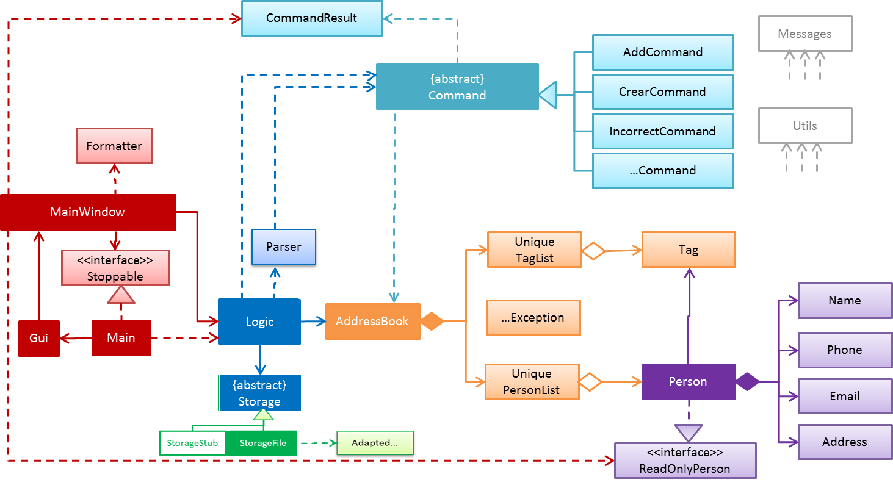

# Developer Guide

* [Setting Up](#setting-up)
* [Design](#design)
* [Testing](#testing)
* [Appendix A: User Stories](#appendix-a--user-stories)
* [Appendix B: Use Cases](#appendix-b--use-cases)
* [Appendix C: Non Functional Requirements](#appendix-c--non-functional-requirements)
* [Appendix D: Gloassary](#appendix-d--glossary)

## Setting up

#### Prerequisites

1. **JDK 8** or later
2. **Eclipse** IDE
3. **e(fx)clipse** plugin for Eclipse (Do the steps 2 onwards given in
   [this page](http://www.eclipse.org/efxclipse/install.html#for-the-ambitious))

#### Importing the project into Eclipse

0. Fork this repo, and clone the fork to your computer
1. Open Eclipse (Note: Ensure you have installed the **e(fx)clipse plugin** as given in the prerequisites above)
2. Click `File` > `Import`
3. Click `General` > `Existing Projects into Workspace` > `Next`
4. Click `Browse`, then locate the project's directory
5. Click `Finish`

## Design

## Testing

* In Eclipse, right-click on the `test/java` folder and choose `Run as` > `JUnit Test`

## Appendix A : User Stories

Priorities: High (must have) - `* * *`, Medium (nice to have)  - `* *`,  Low (unlikely to have) - `*`

Priority | As a ... | I want to ... | So that I can...
-------- | :-------- | :--------- | :-----------
`* * *` | new user | see usage instructions | refer to instructions when I forget how to use the App
`* * *` | user | add a new person |
`* * *` | user | delete a person | remove entries that I no longer need
`* * *` | user | find a person by name | locate details of persons without having to go through the entire list
`* *` | user | hide [private contact details](#private-contact-detail) by default | minimize chance of someone else seeing them by accident
`*` | user with many persons in the address book | sort persons by name | locate a person easily
`* *` | user | list persons by specified tag | to see all persons I have under specific tag | to categorize contacts in address.
`* *` | user | option to update person info | to accommodate for any updates or changes in the contacts personal info like a change in address or phone number as well as for correcting any typos or mistakes.
`* *` | user | option to add notes or comment for each person | to be able to note down any need to know info on person like address directions.
`* *` | user | option to accept more than one phone number and email | many people might have more than one phone for personal and/or work and the same thing for emails, many people have emails that are for personal use of formal use.

## Appendix B : Use Cases

(For all use cases below, the **System** is the `AddressBook` and the **Actor** is the `user`, unless specified otherwise)

#### Use case: Delete person

**MSS**

1. User requests to list persons
2. AddressBook shows a list of persons
3. User requests to delete a specific person in the list
4. AddressBook deletes the person  
Use case ends.

**Extensions**

2a. The list is empty

> Use case ends

3a. The given index is invalid

> 3a1. AddressBook shows an error message  
  Use case resumes at step 2
  
  

#### Use case: Rename old tag

1. User requests to list tags
2. AddressBook shows a list of tags
3. User requests to rename a specific tag
4. AddressBook asks User to confirm rename request
5. User confirms request
6. AddressBook asks for a new tag name for tag
7. User enters new name
8. AddressBooks edits tag name into new entered name
Use case ends

**Extensions**

2a. The list is empty

> Use case ends

3a. The given index is invalid

> 3a1. AddressBook shows an error message  
  Use case resumes at step 2
  
7a. Entered tag name already exists

> 7a1. AddressBook shoes an error message that tag name exists   
  Use case resumes at step 6  
 
  

## Appendix C : Non Functional Requirements

1. Should work on any [mainstream OS](#mainstream-os) as long as it has Java 8 or higher installed.
2. Should be able to hold up to 1000 persons.
3. Should come with automated unit tests and open source code.
4. Should favor DOS style commands over Unix-style commands.

## Appendix D : Glossary

##### Mainstream OS

> Windows, Linux, Unix, OS-X

##### Private contact detail

> A contact detail that is not meant to be shared with others
